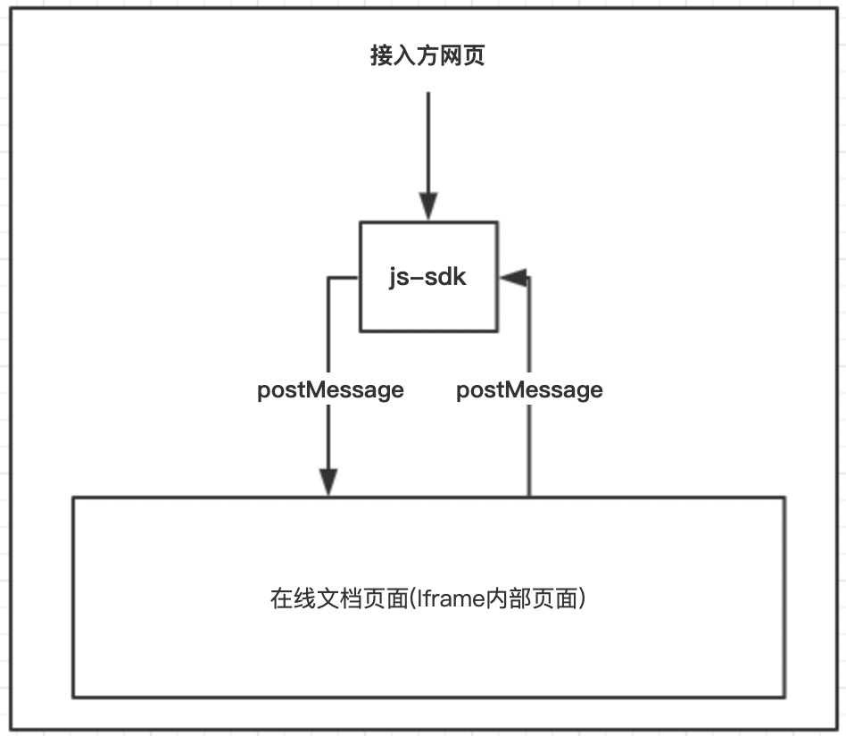

# 注意事项

由于Iframe的跨域安全限制，没办法直接调用Iframe内部的函数和变量，js-sdk提供的高级API对象只是iframe内部对象的映射，通过postMessage进行通信，所以部分对象需要手动销毁，下面举个例子方便理解：

```javascript
const app = demo.ExcelApplication()
// 例如表格获取WorkSheet对象
const sheet = demo.Sheets.Item("sheet1")
// 此时得到的sheet对象只是一个映射对象，它拥有iframe内部对象的所有属性和方法，该对象的所有属性和方法都会映射到iframe内部
sheet.Activate() // 切换sheet
// ...do something
// 不需要该对象时，手动释放，此时会通知iframe内部销毁对应的对象
sheet.Destroy()
```

### 批量释放对象
**由于单个对象销毁比较麻烦，我们提供了接口可以按照区间销毁，可以批量释放**
```javascript
const stack1 = app.Stack()
// do something
stack1.End() // 在stack1区间的对象都会被销毁
```
 

> 需要手动销毁的对象都会在文档中标明

## 包含关系图


