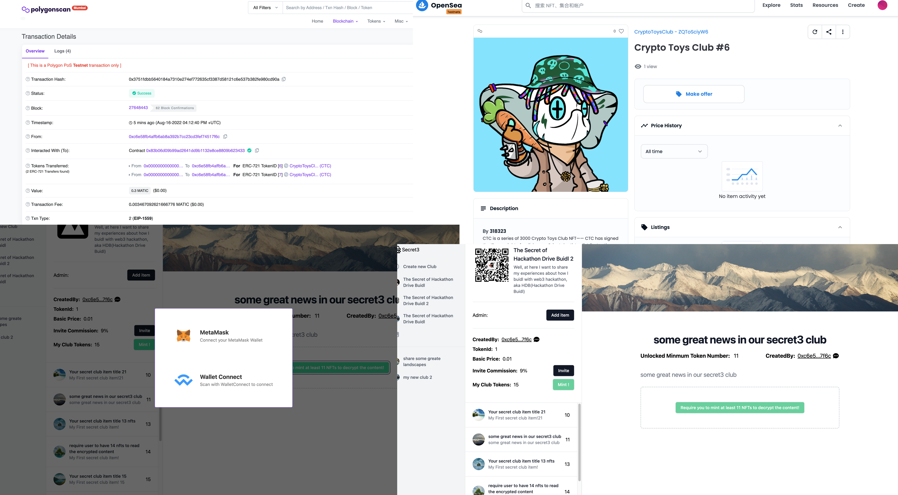

# Web3 Secret Club

## 项目简介

Web3 Secret Club 可以让人们在 web3 世界里通过售卖任何服务来赚钱。
项目在 POC 验证阶段，目前添加了创作者可以创建加密的内容以及加密后的视频直播频道功能(基于 Agora SDK)。

## 使用指南

web-app 目录下，运行 `pnpm i` 后，运行 `pnpm dev` 即可运行开发模式

## 功能简介

* [界面截图](./screenshot/)
* [智能合约源码](./solidity-contract/)
* [前端源码](./web-app/)
* [视频演示](https://www.loom.com/share/2200fe99084e4d5eaf1796e34791264a)
* [在线 demo](https://secret3.nfttop.best/club/5/bafkreia6kk25daifeygeojf4r2n5zvw7qccwln56ngthysje4kciutwsra)  （需要安装 metamask 才可以链接到区块链使用 web3）
* 创作者可以管理其 Web3 版本的秘密俱乐部
  * 创建新的俱乐部 [源码](./web-app/src/composables/useNFTStorage.ts)
  * 在俱乐部内新建条目[源码](./web-app/src/components/secret3/dialog/createItem.vue)
    * 可以设定为 liveStream，即使用 Agora 直播功能，满足条件的俱乐部成员可以获得访问直播的权限
    * 可以设定为加密后的博客内容，满足条件的俱乐部成员可以自动解锁内容（完全Web3链上逻辑）
* 用户可以通过 mint NFT token 来加入俱乐部并获得加密的内容  [源码](./web-app/src/components/secret3/items.vue)
  * 至少有一枚 token 即可加入俱乐部
  * 分享邀请用户可以获得分红
  * mint 俱乐部的 NFT token是需要付费的
    * 总支付金额 = basicPrice * tokenAmount
    * 邀请获得佣金奖励： 被邀请用户总支付额度 * ${inviteCommission}%
  * 自动获得解密内容（包括视频直播及加密内容）  [源码](./web-app/src/pages/secret3/club/%5BtokenId%5D/%5Bcid%5D.vue)
* 平台获得 1% 的总支付额度作为平台收益
* 合约基于 `ERC1155` 基础上添加了各种相关业务功能开发的 [源码](./solidity-contract/Secret3.sol)

## 技术栈

* [x] 声网 SDK
* [x] IPFS
* [x] OpenZepplin
* [x] ERC1155
* [x] Hardhat
* [x] Vercel
* [x] TailwindCSS
* [x] Vue3
* [x] Pinia (state store)
* [x] PWA
* [x] Vite2

## 二次开发

无

# 许可协议

该参赛作品的源代码以`MIT`开源协议对外开源
