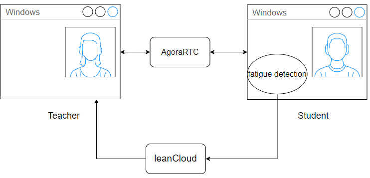
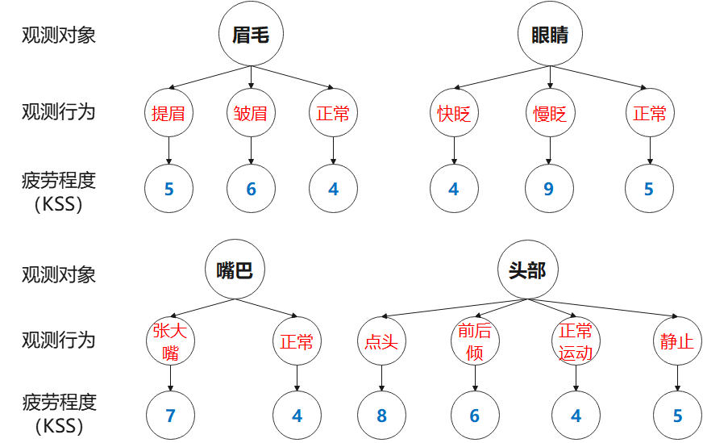
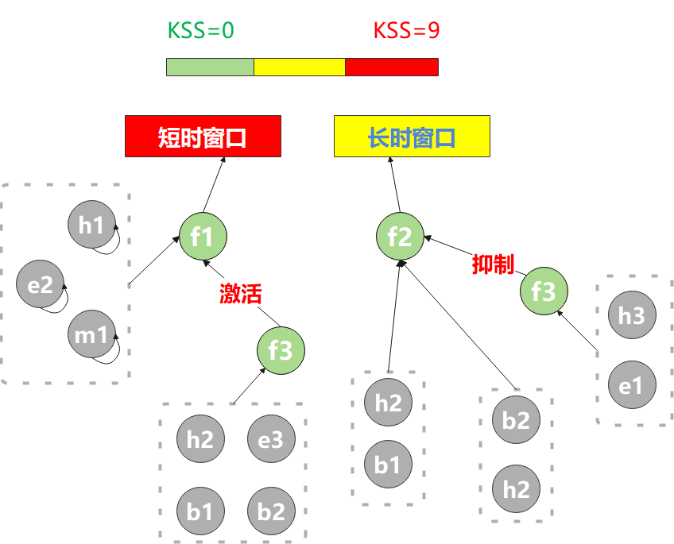
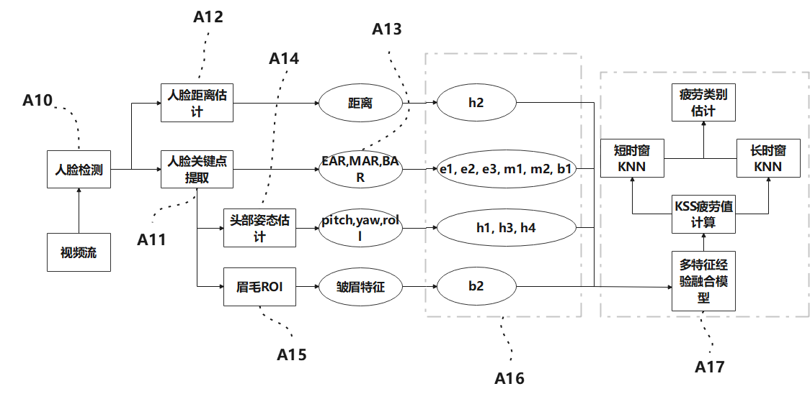
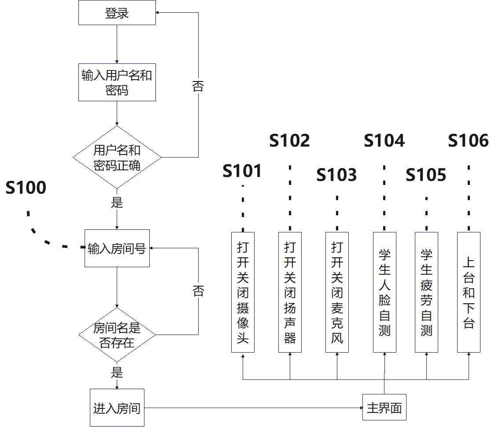
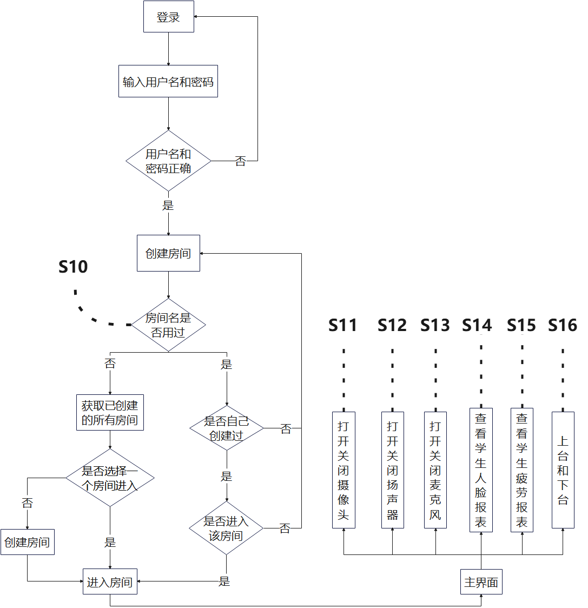

# 基于学生疲劳检测的在线课堂系统

## 1. 项目介绍

这个项目的设计初衷，一开始是为了让自己所提出的疲劳检测算法能够项目落地。结合时代背景，考虑到学生在线课堂教育会成为后疫情时代的发展趋势，但是现如今的在线课堂教育的弊端很明显，就是老师无法实时监视学生的学习状态。因此，这里专门使用声网agora SDK + leanCloud + pyqt5，简单实现在线课堂的基本功能。

该系统主要分成学生端，教师端和服务器端：



**前端界面设计**：pyqt5

**后端数据存储**：leanCloud

**音视频通信**：agora SDK

**疲劳检测算法**：多特征经验融合的K近邻疲劳早后期检测算法

### 1）agora SDK使用介绍

agora SDK是PaaS类型的软件，主要对google开源的WebRTC的不足进行优化和扩展，保证了多人在线聊天下音视频的通话质量，具体使用参考 []()

### 2）leanCloud使用介绍

leanCloud是BaaS（后端即服务）类型的软件，即提供了数据的云存储，又提供了前端（python，swift，andriod等）访问leanCloud云端数据的SDK，在后端服务不是很复杂的情况下，简化了后端的开发流程，降低了后端的维护成本。具体使用参考 []()

### 3）疲劳检测算法介绍（先闲聊几句）

该疲劳检测算法的设计依据是以人类行为学为基础的，即对于一个人的疲劳状态，我们可以透过他的行为表现进行判断。常见的疲劳行为包括慢眨眼，打哈欠和点头，而其他行为，比如提眉行为、皱眉行为、头部前后倾与疲劳有关，而手部姿势比如挠头，摸鼻子，托腮，捂嘴也与疲劳有关。

关于面部疲劳检测的研究（我的理解框架），我觉得无外乎从三个方面入手：**一是从多特征的构建入手，尽量在低开销下创建多个特征；二是从模型选择入手，在单一特征的提取上做到足够高的精度；三是从多特征融合模型入手，对低开销提取的多个特征进行综合分析** 

**a）**考虑到<u>疲劳检测的实时性</u>，对可用的模型则比较有限，很多深度学习模型（比如LSTM，Transformer）或许能在眨眼检测，哈欠检测，点头检测得到很好的精度，但在疲劳推理阶段时间开销较大，因此从模型切入研究比较困难。

**b）**考虑到疲劳检测是一个分类任务，而且这个分类任务相对于物体分类来说，并不是很明确，虽然疲劳程度可以用KSS量表进行量化，但其中未免夹杂着主观成分，早期的疲劳检测一般转化成对某种具体疲劳行为（眨眼，哈欠，点头）的研究，大多数的模型是有监督模型（从早期的SVM，到后来的CNN），在一些公开数据集上，有些学者尝试使用多种不同模型进行眨眼检测，检测精度能达到90%以上，然而通过人脸关键点检测 + EAR阈值法也能达到这个精度，而且人脸关键点检测还可以结合MAR阈值法进行哈欠检测，这就使得<u>单独使用某个模型</u>进行特定疲劳行为的检测局限性很大，<u>可扩展性很差</u>。

**c）**关于多特征模型的构建，主要分成两种，一种是无监督学习的模型，常见的有模糊推理系统；二是有监督学习模型（SVM，RF），大多是将多种特征构成的向量作为输入，输出疲劳类别。疲劳类别常使用KSS标注，相关数据集主要包括RLDD，Drozy。由于多种疲劳行为特征在构建时带来一定时间开销，因此融合分析模型不宜使用耗时的模型。在我看来，疲劳类别的KSS标注包含很多主观因素，用有监督方法训练得到的模型大多是<u>过拟合的模型</u>，个人建议<u>使用类似于模糊推理系统的无监督方法</u>。

关于疲劳检测的难点，我觉得无外乎有两点：**一是眨眼，哈欠检测容易受头部姿态的影响，单一阈值并不适用于多种姿态下的眨眼哈欠检测；二是多种疲劳特征的有效融合问题，使用有监督模型容易得到过拟合的模型，如何设置一个好的，可解释性强的模型至关重要**。

因此本项目提出的疲劳检测算法有如下优点：

- 引入了提眉和人脸距离特征，增加冷对提眉、头部前后倾动作的识别。（多特征的构建）

- 使用自适应的EAR，BAR阈值进行眨眼，提眉检测。（单一特征的优化）
- 对疲劳行为设置KSS值和权重。（减少KSS标注的主观性，将人为经验融入到模型中）

- 使用多特征经验融合模型将多特征融合成一个KSS值（无监督的多特征融合）
- 设置长短时间窗口，使用长短时KNN进行KSS值的学习（将RLDD整个视频作为一个样本进行学习，保证了模型学习的有效性）


算法步骤如下：

**人脸检测**：SCRFD-0.5GF

**68个人脸关键点检测**：MobileNetV2

**头部旋转运动检测**：pnp算法计算头部姿态3个自由度，通过计算各自由度的一阶差分 和 阈值比较，进行点头，正常运动，头部静止的检测。

**头部前后运动检测**：通过小孔成像原理，计算人脸与摄像头的距离，利用一阶距离差分 和 阈值判断，识别前后倾动作。

**慢眨眼检测**：基于校准EAR，头部姿态的自适应眨眼阈值adaptive_EAR_threshold，利用EAR、PERCLOS进行两阶段慢眨眼检测。

**哈欠检测**：基于头部姿态的哈欠检测算法，利用MAR、FOM，进行两阶段哈欠检测

**提眉检测**：基于校准BAR（眉眼纵横比），头部姿态的自适应提眉阈值adaptive_BAR_threshold，利用BAR进行提眉检测。

~~**皱眉检测**：基于22,23,28三个关键点坐标裁剪两眉ROI矩形区域（需要先将人脸旋转至正脸），利用sobel算子提取皱眉边缘，使用MobileNetV3进行皱眉检测。（该算法平衡了检测速率和检测精度，不使用该模块）~~

**疲劳行为编码以及KSS值设置**：

| 眉毛         | 提眉  b1   | 皱眉  b2   | 正常  b3     | /        |
| ------------ | ---------- | ---------- | ------------ | -------- |
| **眨眼**     | 快眨眼  e1 | 慢眨眼  e2 | 正常  e3     | /        |
| **嘴巴**     | 哈欠  m1   | 正常  m2   | /            | /        |
| **头部姿态** | 点头  h1   | 前后倾 h2  | 正常运动  h3 | 静止  h4 |



**多种疲劳行为KSS值的经验融合**：这里利用归一化的经验KSS值，以及疲劳行为的检测次数，定义了singleton（$f_1$），mutual（$f_2$），active/inhibit（$f_3$）三种算子；并通过人为经验构建出的多种疲劳行为的因果图，赋予了三种算子具体的含义：

- $f_1$算子主要是针对眨眼，哈欠和点头三种**明显疲劳行为**，通过一开始赋予的高KSS值 $\times$ 统计次数，来计算后期疲劳得分。
- $f_2$算子主要是针对头部前后倾，提眉和皱眉三种**早期疲劳行为**，通过一开始赋予的中KSS值  $\times$ 统计次数，接着使用tanh激活函数，max函数，来计算最大的早期疲劳得分。
- $f_3$算子主要对$f_1,f_2$算子起辅助作用，由下图所示，$f_3$算子对$f_1$算子起到激活作用，放大后期疲劳得分；$f_3$算子对$f_2$算子起到抑制作用，降低早期疲劳得分，避免对早期疲劳的误判；


$$
f_1 = α × KSS\_norm_{code_i}×count\_norm_{code_i}  \\
f_2 = tanh(\beta(\sum_j (KSS\_norm_{code_j} × count\_norm_{code_j}))) + α Max_j (KSS\_norm_{code_j}× count\_norm_{code_j})  \\
f_3 = tanh(β (\sum_k(KSS\_norm_{code_k} × count\_norm_{code_k}) )) \\
activate = f_3 = -inhibit
$$
**长短时KNN进行疲劳学习**：引入两个KNN模型，并将RLDD数据集中每个视频提取的短时窗口KSS和长时窗口KSS，分别作为两个KNN的训练样本（先进行归一化，这样训练的模型可以用于实时早后期疲劳估计）。

**算法整体框架**：可以发现，基于人脸关键点检测，可以提取很多有用的面部疲劳行为，时间开销很小。



## 2. 实现功能

### 1）学生端实现流程



实现效果（界面做得有点简陋，别介意哈）：

- **打开/关闭扬声器，打开/关闭麦克风**（进入房间之后，先采集学生正脸信息，更新该学生的EAR，BAR校准值，接着自动完成人脸自测，疲劳自测）

  

- **上台表演和下台听课**：当没有人在台上时，你可以上台表演。

  

### 2）教师端实现流程



实现效果：

- **查看学生人脸报表**：老师可以知道哪个学生不在屏幕前，哪个学生没在看屏幕（暂时不显示哪个学生在认真听讲）

  

- **查看学生疲劳报表**：老师可以知道哪个学生犯困了（后期疲劳），哪个学生有点疲劳（暂时不显示哪个学生保持清醒）

  

## 3. 未实现功能

### 1）学生端未实现功能

- 打开和关闭摄像头
- 为按钮设置图标

### 2）老师端未实现功能

- 打开和关闭摄像头
- 根据疲劳等级，排序子窗口（为的是让老师能第一时间知道哪个学生犯困了）
- 为按钮设置图标

这里只是简单做一个学生疲劳检测的在线课堂小demo，为的是能让疲劳检测和在线课堂练习起来，至于在线课堂的一些bug，以后有时间再来处理。

## 4. 环境配置

`requirements.txt`文件如下

```txt
agora_python_sdk==3.1.2.10
agora_token_builder==1.0.0
APScheduler==3.9.1
joblib==1.1.0
leancloud==2.9.10
matplotlib==3.5.2
numpy==1.22.3
onnxruntime==1.11.1
opencv_python==4.4.0.42
pandas==1.4.2
Pillow==9.1.1
plotly==5.8.0
PyQt5==5.15.6
PyYAML==6.0
scikit_learn==1.1.1
scipy==1.8.1
torch==1.10.1
torchvision==0.11.2
```

接着 `pip install -r requirements.txt`即可。

## 5. leanCloud配置

### 1）账号配置

在`config.yaml`文件中填上你的leanCloud账号：你的appId，appKey和masterKey

```yaml
 #leancloud appId
leancloud_appId : 'your appId'

#leancloud appKey
leancloud_appKey : 'your appKey'

#leancloud masterKey
leancloud_masterKey : 'your masterKey'

#agora账号信息
leanCloud_agora_info : "Agora_info"

#房间表名
leancloud_chatroom : 'Chatroom'

#学生表名
#leancloud_student : "Student"

#老师表名
leancloud_teacher : "Teacher"
```

### 2）数据表的构建

下面可以根据json数据中的字段，创建你的leanCloud表

**Agora_info**：Agora声网信息表，用于创建实际上的房间

```json
{
  "appCertificate": "your agora appCertificate",
  "appId": "your agora appId",
  "ACL": {
    "*": {
      "read": true
    }
  },
  "createdAt": "2022-05-23T17:05:45.821Z",
  "updatedAt": "2022-05-23T17:05:45.821Z",
  "objectId": "628bbee9033caa54ba643d53"
}
```

**Chatroom**：房间信息表

```json
{
  "updatedAt": "2022-06-05T15:52:57.083Z",
  "ACL": {
    "*": {
      "read": true,
      "write": true
    }
  },
  "teacher": {
    "__type": "Pointer",
    "className": "Teacher",
    "objectId": "628b87bb5e07a13788dd6547"
  },
  "name": "UNICODE",
  "objectId": "628ced73033caa54ba649f11",
  "createdAt": "2022-05-24T14:36:35.696Z",
  "stream_low": [],
  "stream_high": null,
  "members": [],
  "dual_status": 597
}
```

**Student**：学生信息表

```json
{
  "name": "wangxiaoxi",
  "password": "7c4a8d09ca3762af61e59520943dc26494f8941b",
  "ACL": {
    "*": {
      "read": true,
      "write": true
    }
  },
  "createdAt": "2022-05-23T07:30:27.493Z",
  "updatedAt": "2022-06-05T15:45:50.656Z",
  "uid": "1",
  "chatroom_id": "628ced73033caa54ba649f11",
  "objectId": "628b3813033caa54ba641f9c"
}
```

**Teacher**：老师信息表

```json
{
  "name": "王大锤",
  "password": "7c4a8d09ca3762af61e59520943dc26494f8941b",
  "ACL": {
    "*": {
      "read": true,
      "write": true
    }
  },
  "createdAt": "2022-05-23T13:10:19.543Z",
  "updatedAt": "2022-05-23T13:10:19.543Z",
  "objectId": "628b87bb5e07a13788dd6547"
}
```

**Face_detection**：人脸疲劳检测表

```json
{
  "updatedAt": "2022-06-05T15:46:12.754Z",
  "face_state": 1,
  "BAR_estimate": 0.6396077723786673,
  "ACL": {
    "*": {
      "read": true
    }
  },
  "chatroom_id": "628ced73033caa54ba649f11",
  "objectId": "629a11e15e07a13788e1023f",
  "username": "wangxiaoxi",
  "createdAt": "2022-06-03T13:51:29.829Z",
  "fatigue_state": 0,
  "EAR_estimate": 0.3044230252503477,
  "fatigue_count": 346
}
```

## 6. 疲劳算法配置

如果在使用默认配置的参数下，疲劳检测效果不是很好，可以考虑修改如下两个配置文件

### 1）疲劳检测算法各阈值配置

在`detect_config.yaml`中：

```yaml
#疲劳检测平均FPS
AVG_FPS : 7.5

#模型权重文件
scrfd_weights : "scrfd_500m_kps.onnx"   #scrfd人脸检测器权重文件相对于demo的文件路径
frown_model_weights : "frownMobileNet_CE_sobel.pth"   #皱眉模型权重文件相对于demo的文件路径

#校准图片路径
calibrate_imgs : ["img/calibrate_glasses.jpg","img/calibrate_noglasses.jpg"]

#Perclos阈值,用于快眨眼慢眨眼检测
PERCLOS_time_window_length : 30   #计算perclos时的EAR窗口长度
PERCLOS_range : [0.3,0.5]  #当perclos小于0.3时为快眨眼，0.3 < perclos < 0.5表示正常眨眼，perclos > 0.5表示慢眨眼

#EAR自适应阈值超参数
EAR_alpha : 0.8   #通过校准图片的EAR * EAR_alpha得到初始EAR阈值
EAR_pitch_range : [-8,-5,10,16]   #通过头部姿态pitch区间，根据对应的EAR_beta更新初始EAR阈值, len(EAR_pitch_range) = 4, 元素从小到大
EAR_beta : [0.75,0.85,1,0.85,0.75]  #pitch<-8时，通过EAR_threshold * 0.75来更新阈值, len(EAR_beta) = 5
EAR_yaw_threshold : -20 #根据头部姿态yaw值，选择用那只眼睛计算EAR, yaw < -20选择左眼计算EAR； yaw > -20,选择右眼计算EAR

#BAR自适应阈值超参数
BAR_alpha : 1.2   #通过校准图片的BAR * BAR_alpha得到初始BAR阈值
BAR_pitch_range : [-3,8,14,20]   #通过头部姿态pitch区间，根据对应的BAR_beta更新初始BAR阈值, len(BAR_pitch_range) = 4, 元素从小到大
BAR_beta : [0.95,1,0.95,0.9,0.88]  #pitch<-3时，通过BAR_threshold * 0.95来更新阈值, len(EAR_pitch_range) = 5
BAR_yaw_range : [-20,20]   #根据头部姿态yaw值，选择用那个眉毛计算BAR, yaw < -20选择左眉计算EAR； yaw > 20,选择右眉计算EAR；其他情况两眉去平均

#哈欠阈值
MAR_threshold : 0.6
FOM_TIMEWINDOW_LENGTH : 65  #基于FOM的哈欠检测时间窗口长度
FOM_threshold : 0.6   #FOM哈欠检测阈值

#关于头部姿态的运动检测超参数
deltaX_threshold : 1.5 #pitch差分阈值，用于检测点头
nodding_window_length : 10 #点头是一个反复的动作，需要设置时间窗口长度，如果mean > deltaX_threshold，则标记为点头
deltaDist_threshold : 0.5 #距离差分阈值，用于检测前后倾
deltaY_threshold : 10  #yaw差分阈值，用于过滤掉左右旋转引起距离差分增强的问题
front_behind_WL : 3  #前后倾动作是一个快运动，默认时间窗口为3，如果mean.deltaD > deltaDist_threshold且mean.deltaY < deltaY_threshold，则标记为前后倾
action_threshold : 5  #正常运动检测阈值，如果pitch，roll，yaw超过该阈值，则标记为运动。
```

### 2）多种疲劳行为的因果图配置

在`fatigue_strategies.txt`中：

```txt
#short_timeWindowLength
5s

#long_timeWindowLength
30s

#kss_map
{
    "e1": 4, "e2": 9, "e3": 5,
    "h1": 8, "h2": 6, "h3": 4, "h4": 5,
    "m1": 7, "m2": 4,
    "b1": 5, "b2": 6, "b3": 4
}

#count_weight_map
{
    "e1": 1, "e2": 5, "e3": 1,
    "h1": 5, "h2": 2, "h3": 1, "h4": 1,
    "m1": 5, "m2": 1,
    "b1": 1, "b2": 2, "b3": 1
}

#singleton
[e2,m1,h1]

#mutual
[h2,b1],[h4,b1]

#activate
+[h2],+[e3],+[b1],+[b2],-[h3],-[e1]

#fatigue2_ratio
0.3

#fatigue3_ratio
0.15
```

你可以根据你的行为习惯，手动修改`kss_map`中疲劳行为**KSS值**，修改`count_weight_map`中关于疲劳行为的**检测权重**。

## 7、参考资料

参考资料

- [PyQt5知识点整理](https://blog.csdn.net/qq_33934427/article/details/125165508)

- [leanCloud python SDK的使用](https://blog.csdn.net/qq_33934427/article/details/124916788)

- [Agora python SDK的使用](https://blog.csdn.net/qq_33934427/article/details/125165508)

- [AgoraRTC_local_face_regonization 人脸检测项目](https://gitee.com/wangxiaoxi-1/AgoraRTC_local_face_regonization) 

  