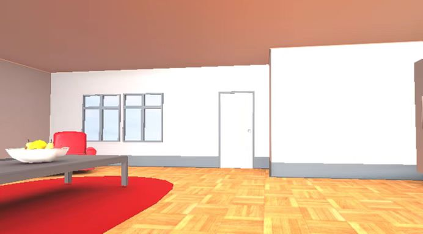

<!-- 内容建议:以下为建议你可以补充的内容要点和方向 -->

项目文件太大，请参考这里：https://pan.baidu.com/s/1LeYdXXnrNsjcf3EpjjCfzw 提取码: jg3f

# 项目名 
元宇宙metaverse

## 项目简介

该死的疫情，让经济不再活跃，线下的一切活动变得不再热闹，举办方各方面因素受限(交通，时间，空间，成本，人力等等)
参与者也因为整体环境的因素，减少了线下活动的参与习惯

我们通过3D技术还原了真实的活动场景并且可以定制化更多的场景
（举办成本较低，场景空间想象力更加强大）
通过link的形式传播给更多人，真正做到随时随地的参与其中
（用户参与成本降低，体验更加丰富多样）
实时音频互动，ARVR

## 安装部署指南
unity工程打开

## 功能简介
移动端网页链接，也可以VR端链接，都可以连接到同一个界面，实现跨平台多人链接

## 技术栈
unity

## 二次开发
无

## 其他资料
无
---
# 许可协议

该参赛作品的源代码以`MIT`开源协议对外开源

