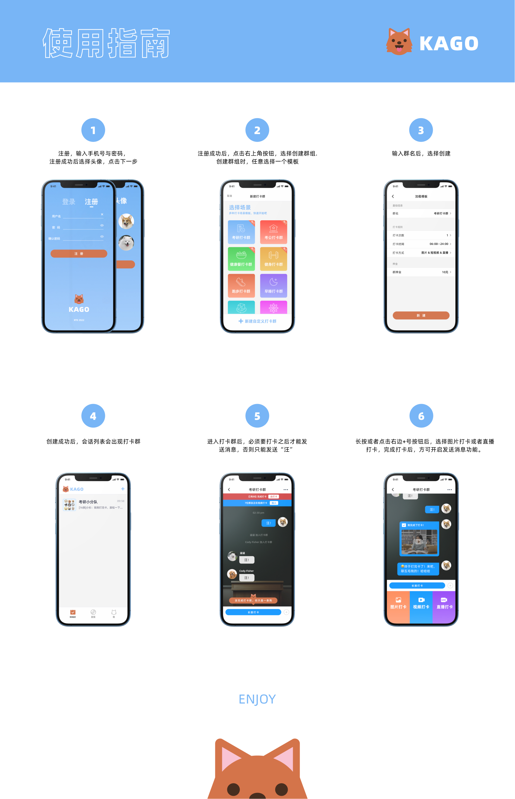

# Kago-打卡狗

## 项目简介


## 安装部署指南
服务端已部署公有云。
服务端代码：

**punch-card-server**

客户端代码：

**PunchCardTogether**

移动端只需打开`PunchCardTogether.xcworkspace`工程，打开直接 build 即可运行。


## 功能简介


https://user-images.githubusercontent.com/8814535/185784983-b48bff9e-a7fb-4396-bd25-20095744547c.mov


https://user-images.githubusercontent.com/8814535/185785003-8dbb5556-bfa4-486a-acd6-b3df759a2517.mov


## 使用指南

## 技术栈
后端架构：
1. Nodejs
2. Egg+mysql
后端已部署服务器
自行部署: 修改config/config.default.js 数据库和声网相关配置key。

移动端架构：
1. SwiftUI
2. Combine
3. RxSwift
4. UIKit

打卡狗依赖声网的 RTCSDK 与 环信的IM SDK，构建群聊，打卡，视频连线等基础功能，实现打卡狗的一系列产品逻辑。

SwiftUI 为 苹果新出的声明式 UI 框架，用以替代传统的 UIKit。
Combine 为响应式编程框架。

本项目采用了两种架构来完成。
1. 传统的 UIKit + ReactorKit 来完成核心模块的研发来保证质量
2. SwiftUI + Combin 完成非核心模块的研发，保证速度

核心模块由 Feature 组成，Feature 可以理解为一个具备独立功能的 Page。
利用 Reactor 将 View 与 State 进行双向绑定。来实现业务逻辑的整洁有序。


如 聊天列表页面，基于响应式编程框架，代码变得优雅简洁

```swift
reactor.pulse(\.$indexPath)
            .compactMap { $0 }
            .subscribe(onNext: {
                [weak self] indexPath in
                self?.tableView.scrollToRow(at: indexPath, at: .bottom, animated: false)
            })
            .disposed(by: disposeBag)
        
        reactor.state
            .map(\.signInStatus)
            .distinctUntilChanged()
            .bind(to: inputBar.rx.signButtonEnabled)
            .disposed(by: disposeBag)
        
        rx.viewDidLoad
            .map {
                Reactor.Action.refreshMessages
            }
            .bind(to: reactor.action)
            .disposed(by: disposeBag)
        
        MessageCenter.shared.messageUpdates
            .map {
                [weak self] in
                $0.filter { message in
                    message.conversationId == self?.conversationId
                }
            }
            .map {
                Reactor.Action.appendMessages($0)
            }
            .bind(to: reactor.action)
            .disposed(by: disposeBag)
```

## 二次开发
无

# 许可协议

该参赛作品的源代码以`MIT`开源协议对外开源
