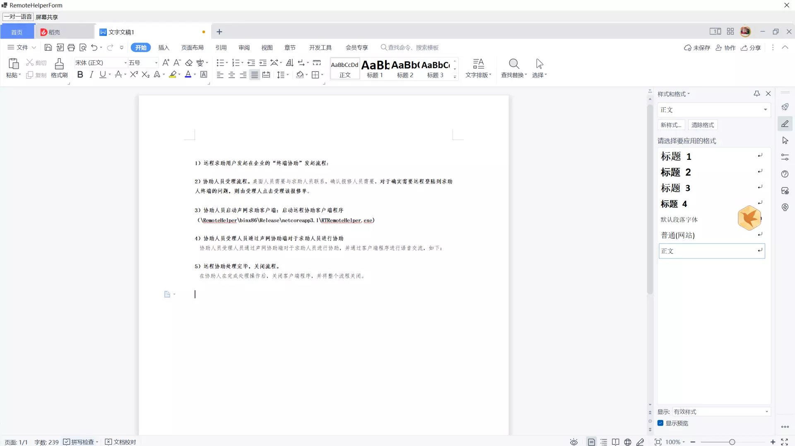

**多媒体远程协助**

**项目简介**

基于声网（Agora)SDK的远程协助程序。由于目前WINDOWS平台下的远程协助程序大多不具备语音沟通的功能，在远程协助时还需要同时开启手机会议等方式使协助人与求助人连线，使用起来不很方便，本项目在远程协助的同时默认开启语单功能，解决沟通方面的痛点。

**安装部署指南**

客户端要求：WINDOWS 7 及后续版本并安装.NET CORE 3.1

**功能简介**

远程协助功能

**技术栈**

C# with .net core

**二次开发**

Agora SDK

**其他资料**

1）远程求助用户发起在企业的“终端协助”发起流程：

2）协助人员受理流程。桌面人员需要与求助人员联系，确认报修人员需要，对于确实需要远程登陆到求助人终端的问题，则由受理人点击受理该报修单。

3）协助人员启动声网求助客户端：启动远程协助客户端程序（\RemoteHelper\binx86\Release\netcoreapp3.1\RTRemoteHelper.exe)

4）协助人员受理人员通过声网协助端对于求助人员进行协助

   协助人员受理人员通过声网协助端对于求助人员进行协助，并通过客户端程序进行语音交流，如下：

5）远程协助处理完毕，关闭流程。

  在协助人在完成处理操作后，关闭客户端程序，并将整个流程关闭。

**许可协议**

该参赛作品的源代码以`MIT`开源协议对外开源