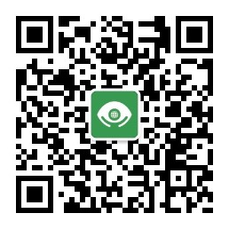
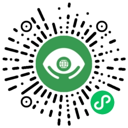

<!-- 内容建议:以下为建议你可以补充的内容要点和方向 -->

# 启明瞳——开始盲人新视界
<!-- 请将上面“项目名”替换为你本次参赛作品的项目名 -->

## 项目简介
<!-- 请描述此次参赛作品的简介，建议用「一句话简介」+ 详细介绍的形式 -->
启明瞳——开启视障者新视界
启明瞳和助助盲系统依托智能手机通过GPS北斗定位导航、人工智能（图像、文字、人脸识别、颜色识别等）、志愿者和由肢体残疾人担任的视频客服三种形式从软件、硬件、服务等三个维度真正解决盲人出行识图等相关问题。

## 安装部署指南
<!-- 请描述该应用的使用步骤，包括下载、依赖安装、参数及软硬件配置（如有）等，特别提醒：如果需要特殊硬件支持，请在 README 中写明，也和大赛官方沟通。 -->

>   盲人使用智能手机需要 在手机设置 找到无障碍配置开启 屏幕阅读的功能更
[开启屏幕阅读（读屏软件）的百科教程](https://jingyan.baidu.com/article/48206aeac78044606ad6b39e.html)

- - -
### 启明瞳APP 
[启明瞳APP应用宝下载链接](https://sj.qq.com/appdetail/cn.com.bemyeyes)

- - -

### 微信小程序使用教程：
### 1.视障者先关注  启明瞳服务号   可以收到相关志愿者通知，

### 2.视障者先关注  启明瞳小程序   可以收到相关志愿者通知，

## 功能简介
<!-- 请给出该应用的主要功能点 -->
参考PPT：
[ppt](./%E9%A1%B9%E7%9B%AE%E4%BB%8B%E7%BB%8Dppt/%E5%90%AF%E6%98%8E%E7%9E%B3%E8%A1%8C%E2%80%94%E2%80%94%E5%BC%80%E5%90%AF%E7%9B%B2%E4%BA%BA%E6%96%B0%E8%A7%86%E7%95%8C.pdf)

 启明瞳——开启盲人新视界是以微信小程序为依托，由团队全职的无障碍工程师进行全面的无障碍优化，为视障者和全国各地盲协搭建启明瞳小程序和启明瞳APP和启明行APP，为全国各地助残助盲志愿者协会搭建轻量志愿者服务号平台，志愿者只需要关注我能帮帮忙微信公共账号就可以轻松成为志愿者，志愿者不需要下载专门的APP就可以帮助盲人的解决问题。  在视障者一端要考虑视障者心里，首先通过AI技术解决视障者80%到90%的问题，剩余10%到20%的复杂问题在启明瞳行里面向发消息一样发给我们搭建的我能帮帮盲系统，由系统后台从关注志愿者协会的公众账号的志愿者随机抽取10个人发送通知消息，志愿者会收模板消息通知，哪位志愿者有空只需要用几秒钟来帮助盲人解答问题。

## 技术栈
<!-- 请给出该应用主要的技术栈，包括使用的声网和环信（如有用） SDK 版本 -->
- 安卓
- 小程序
- agora_rdc
- 无障碍技术

## 二次开发
<!-- 1、如果是基于已有项目进行二次开发的参赛作品，请在此说明主要变更点，并附上原项目链接。2、如果是本次全新开发，请写“无” -->

全新开发，上传次代码中没有展示非核心功能，用到声网的核心都已经上传

## 其他资料
<!-- 能全方位展示你的作品亮点的资料，包括：1、如果是文件，可以放到该仓库你的文件中，在这里附上链接。2、如果是外部视频可以附上链接 -->
## 团队
**知声团队**
目标：译音让聋哑人交流沟通无障碍

团队代表：AceZhou

微信：AceZhou20

手机号：18515399610

邮箱：zhoujn@accessible.org.cn

---
# 许可协议

该参赛作品的源代码以`MIT`开源协议对外开源

<!-- 往年作品 README 参考
https://github.com/AgoraIO-Community/RTE-2021-Innovation-Challenge/blob/master/Application-Challenge/%E3%80%90%E5%8A%A0%E6%B2%B9%EF%BC%8C%E6%89%93%E5%B7%A5%E4%BA%BA%E3%80%91AgoraHomeAI/README.zh.md

https://github.com/AgoraIO-Community/RTE-2021-Innovation-Challenge/blob/master/Application-Challenge/%5Brethinking%5D%E9%83%BD%E5%B8%82%E6%8E%A2%E9%99%A9%E5%AE%B6/Readme.md

https://github.com/AgoraIO-Community/RTE-2021-Innovation-Challenge/blob/master/Application-Challenge/%5B%E5%8F%B2%E5%A4%A7%E4%BC%9F%5D%20%E6%95%99%E5%AD%A6%E5%8A%A9%E6%89%8B/README.md

https://github.com/AgoraIO-Community/RTE-2021-Innovation-Challenge/blob/master/Application-Challenge/%E3%80%90AnakinChen%E3%80%91%E8%BF%9E%E9%BA%A6%E9%97%AE%E7%AD%94PK/README.md -->
