# 2Talk双人音视频通话系统

## 项目简介

**2Talk** 是一个复古怀旧的 Windows 桌面软件，可以邀请好友登录手机号，然后就可以通过手机号拨号，跟好友建立音视频通话。

## 使用指南

**2Talk** 整个系统分为两部分。

1，客户端，客户端采用 **Qt QWidget** 传统的界面技术， 客户端的代码在 **2TalkClient** 目录里面。目前支持Windows 环境。

2，服务器端，服务器端采用 C 语言开发，运行在 Linux 系统上面， 服务器端的代码在 **2TalkServer** 目录里面。、

------

下面来讲解一些 Qt 客户端的编译部署要点。

1，必须选择 **Qt MSVC** 的编译器来编译项目，**本项目不支持 MinGW**。如下：

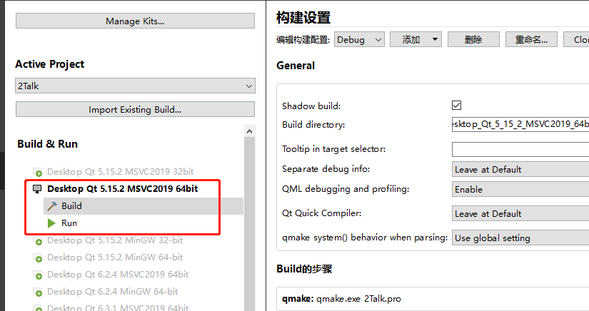

客户端 与 服务器 采用 TCP 通信，所以需要要把 IP 端口 修改成自己的 IP 端口，如下：

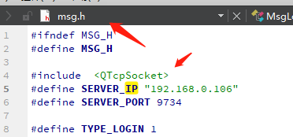

最后安装部署的时候，直接使用 windeployqt.exe 来复制相关的依赖 dll 即可。

------

下面来讲解一些 服务器端的编译部署要点。

直接执行 make 即可编译出 **2TalkServer** 可执行文件，

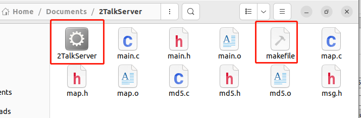

## 功能简介

**主界面：**

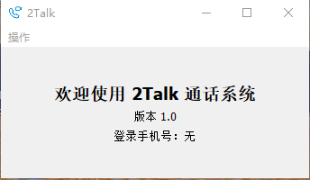

2Talk 有 3 个功能菜单，**登录**，**拨打电话**，**关闭通话**，如下：

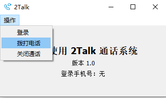

要使用 拨打电话 功能，必须先登录，如下：

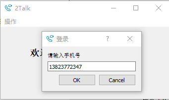

登陆成功之后，会在主界面显示您的手机号。

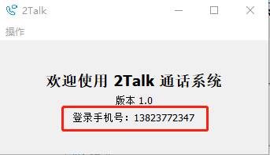

------

现在就可以拨打电话，如下：

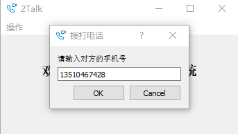

如果您拨打的电话没有登录，是无法接通的，必须在另一台电脑登录这个 13510467428 手机号才能进行视频通话。如果未登陆，会显示如下提示：

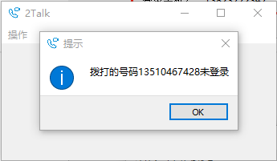

------

如果双方手机都 已经登录，对面就会收到一个提醒，13510467428  可以决定要不要接通您的拨号，如下：

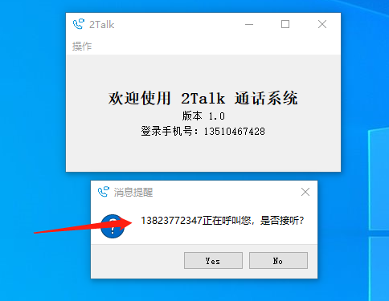

如果接听，双方就能正常看到各自的视频，如下：

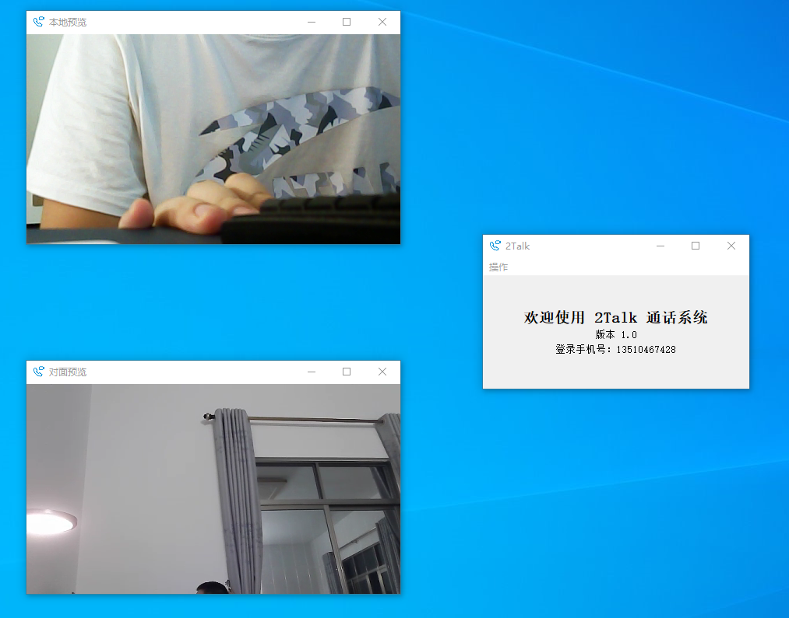

## 技术栈

Qt 客户端使用的 是声网的 视频SDK 4.0

## 二次开发

无

# 许可协议

该参赛作品的源代码以`MIT`开源协议对外开源